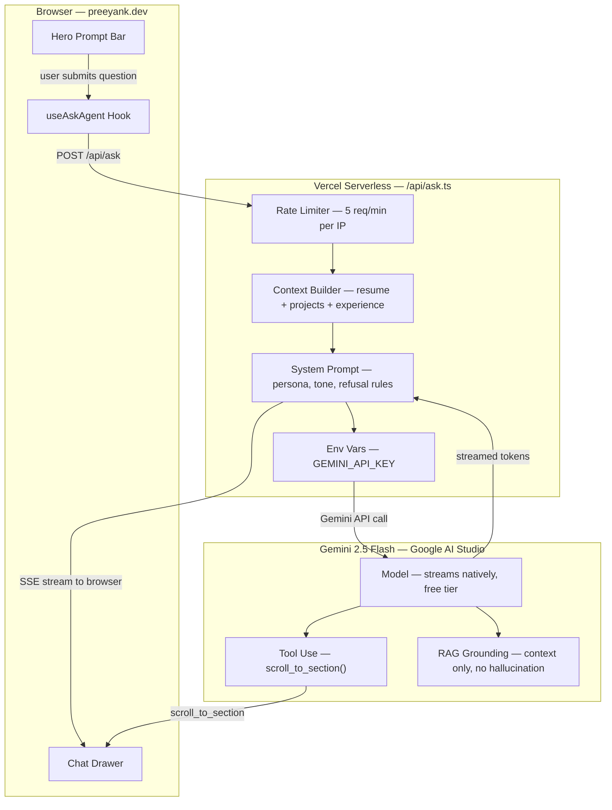

# preeyank.dev

Personal portfolio of **Priyank Bardolia** — full-stack software engineer based in Seattle, WA.

Live at [preeyank.dev](https://preeyank.dev).

## Stack

React 19 · TypeScript · Vite · Hand-written CSS (BEM) · Vercel · Gemini 2.5 Flash

No routing library, no state management, no UI framework. Single-page scroll-based design.

## Commands

```bash
npm run dev        # start dev server
npm run build      # tsc -b && vite build
npm run lint       # eslint
npm run preview    # preview production build
```

---

## Ask Preeyank — Architecture

Conversational résumé feature. Allows recruiters and hiring managers to interrogate experience, projects, and skills in natural language — grounded in real content, no hallucinations.



### Layer Breakdown

**Browser**
- **Hero prompt bar** — ambient input field visible on page load, slow-blinking cursor, rotating suggestion chips. On submit, opens the chat drawer.
- **Chat drawer** — full-height right-side panel, streams tokens live, renders conversation history, suggestion chips after each response.
- **useAskAgent** — React hook managing conversation state, SSE connection to proxy, and tool call execution (e.g. `scrollIntoView` when model calls `scroll_to_section`).

**Vercel Proxy (`/api/ask.ts`)**
- **Rate limiter** — 5 requests/min per IP + hard daily cap. Blocks scrapers, invisible to normal users.
- **Context builder** — assembles ~600 tokens of real content from `src/content/*.ts` files. Single source of truth — no duplication.
- **System prompt** — defines persona, tone (first-person, concise, no marketing fluff), refusal rules, and the hard guard: *"If you don't know from context, say so. Never fabricate."*
- **Env vars** — `GEMINI_API_KEY` lives only here. Never reaches the browser bundle.

**Gemini 2.5 Flash**
- **Model** — low latency, streams natively, generous free tier (1500 RPD).
- **Tool use** — `scroll_to_section(id)` defined in the proxy. Model decides when to call it; hook executes the actual DOM scroll.
- **RAG grounding** — not fine-tuned. Context injected per request. Change a content file, the bot knows immediately.

